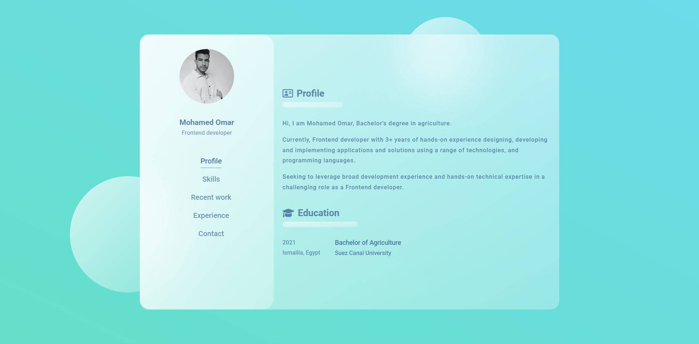

# mohamed-omar

### Screenshot


## Description
```
My portfolio website built with Vue 2, vuetify v2.6.7, Vue-i18n, Bootstrap v5.1.3.
```

## Project setup
```
npm install
```

### Compiles and hot-reloads for development
```
npm run serve
```

### Compiles and minifies for production
```
npm run build
```

### Run your unit tests
```
npm run test:unit
```

### Lints and fixes files
```
npm run lint
```

### Customize configuration
See [Configuration Reference](https://cli.vuejs.org/config/).
